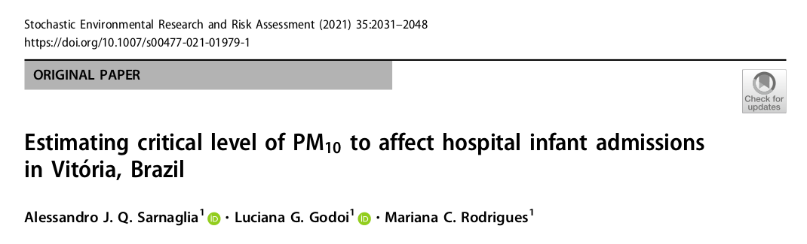
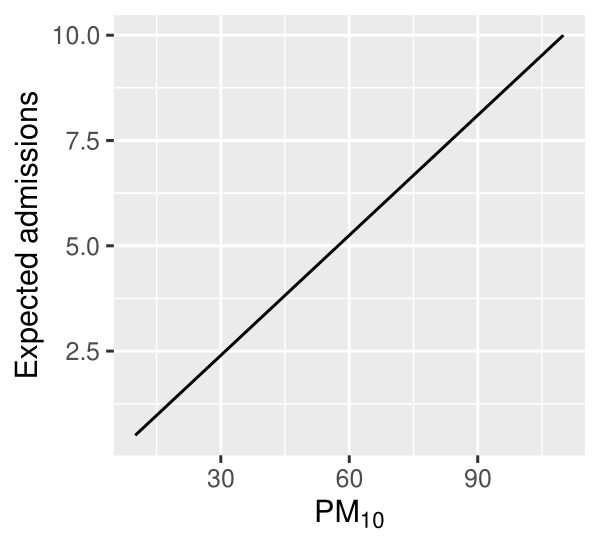
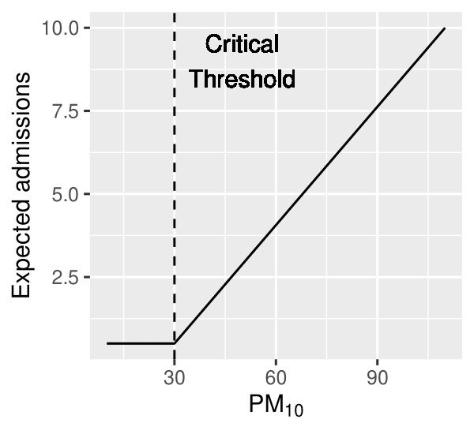
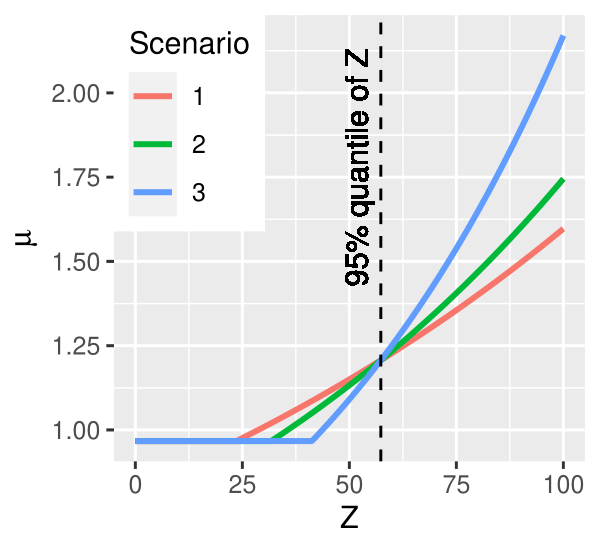
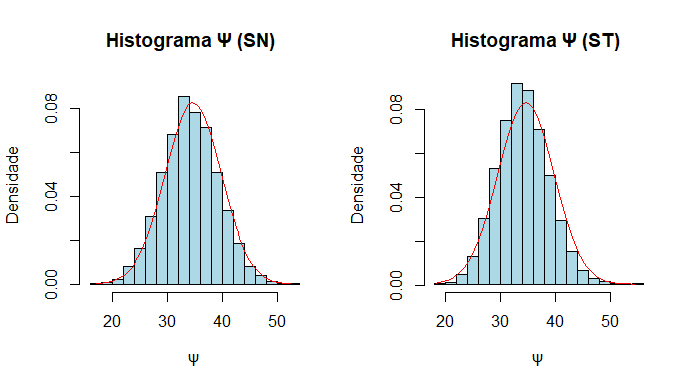

class: animated, fadeIn, middle

[//]: <> (https://pkg.garrickadenbuie.com/extra-awesome-xaringan/intro/index.html#1)
[//]: <> (https://pkg.garrickadenbuie.com/xaringanthemer/articles/xaringanthemer.html)
[//]: <> (https://www.biostatistics.dk/talks/CopenhagenRuseRs-2019/index.html#1)
[//]: <> (https://rstudio-education.github.io/sharing-short-notice/#1)
[//]: <> (https://www.kirenz.com/slides/xaringan-demo-slides.html#1)
[//]: <> (https://github.com/yihui/xaringan/issues/26)
[//]: <> (https://pkg.garrickadenbuie.com/countdown/#1)

```{r xaringan-themer, include=FALSE, warning=FALSE}
library(xaringanthemer); library(dplyr); library("DT"); library(plotly) #library(icons)
style_mono_light(base_color = "#23395b")
```
```{r setup, include=FALSE}
options(htmltools.dir.version = FALSE)
```
```{r, load_refs, include=FALSE, cache=FALSE}
library("RefManageR"); library("bibtex"); library("knitr")
BibOptions(check.entries = FALSE,
           bib.style = "authoryear",
           cite.style = "authoryear",
           style = "markdown",
           hyperlink = FALSE,
           dashed = FALSE)
myBib <- ReadBib("ref_ementa.bib", check = FALSE)
```

<style> body {text-align: justify} </style> <!-- Justify text. -->

```{r the-toc, include=FALSE}
infile <- knitr::current_input()
outfile <- "the-TOC.Rmd"
outline_heading <- "# Sumário"
update_TOC <- TRUE
source("R/child_TOC.R")
```


```{r child = "the-TOC.Rmd"}
```

---
class: animated, inverse, middle, center, fadeIn
# Motivação

---
class: animated, fadeIn

## Motivação - I
Diversos estudos tem apontado os efeitos deletérios de poluentes atmosféricos na saúde humana.

--

Pelo ponto de vista fisiológico, os poluentes tem sido associados a doenças dos sistemas:
- cardiovascular `r Citep(myBib, "riediker:etal:2004")`;
- cerebrovascular `r Citep(myBib, "wellenius:schwartz:mittleman:2005")`;
- e, principalmente, respiratório `r Citep(myBib, c("balmes:fine:sheppard:1987", "kagawa:1985", "uysal:schapira:2003", "wiwanitkit2008", "li:huang:zou:2008"))`.

--

Do ponto de vista de saúde pública, o Material Particulado (PM) é considerado como um dos poluentes mais importantes, causando efeitos adversos em morbidade, mortalidade e admissões hospitalares `r Citep(myBib, "anderson:thundiyil:stolbach:2012", before="veja uma revisão compreensiva em ")`.

--

O PM é classificado de acordo com o seu diâmetro, tendo em vista que essa característica determina a capacidade de penetração no organismo. Em especial, são considerados PM com diâmetros $\leq$ 10 &#181;m $(\text{PM}_{10})$, $\leq$ 2,5 &#181;m $(\text{PM}_{2,5})$ e $\leq$ 0,5 &#181;m $(\text{PM}_{0,5})$.

--

Embora menos prejudicial, o $\text{PM}_{10}$ é o PM mais estudado na literatura. Segundo a Organização Mundial de Saúde (OMS), as crianças e os idosos formam os grupos mais impactados pelo $\text{PM}_{10}$ `r Citep(myBib, "who:2018")`.

---
class: animated, fadeIn

## Motivação - II

Neste estudo são considerados os efeitos do $\text{PM}_{10}$ em admissões hospitalares por causas respiratórias em crianças com 10 anos ou menos.

--

Muitos estudos têm mostrado que um incremento em concentrações de $\text{PM}_{10}$ tende a provocar um incremento de admissões hospitalares por causas respiratórias. Veja por exemplo:
- `r Citet(myBib, c("chen:etal:2010"))`;
- `r Citet(myBib, c("son2013short"))`;
- `r Citet(myBib, c("lagravinese2014impact"))`;
- `r Citet(myBib, c("oliveira2016association"))`;
- `r Citet(myBib, c("slama:etal:2019"))`.

--

Em geral, esses estudos fazem uso de métodos de regressão linear ou de séries temporais. Baseada em estudos similares, a OMS definiu diretrizes de qualidade do ar com níveis padrões para cada poluente.

--

Para o $\text{PM}_{10}$, o padrão estabelecido pela OMS é de 50 <span>&#181;</span>g/m<sup>3</sup> para concentrações médias de 24 horas.

--

**Importante:** as abordagens empregadas pelos estudos acima implicitamente supõem que a relação functional entre a(s) preditora(s) e a resposta não depende do valor da(s) preditora(s).

---
class: animated, fadeIn

## Motivação - III

Neste estudo, nós adotamos estratégia similar a adotada em `r Citet(myBib, "sarnaglia2021estimating")`.

--

```{r, out.width='85%', fig.align='center', fig.cap='',echo=FALSE}

```

--

**Suposição:** É esperado que, em concentrações abaixo de um limiar desconhecido, indivíduos tolerariam os efeitos da poluição do ar, de modo que não haveria alteração na busca por atendimento médico, enquanto que, acima do referido limiar, o desconforto nos indivíduos causaria aumento de admissões hospitalares.

---
class: animated, fadeIn

## Motivação - IV

As figuras abaixo mostram a diferença entre a suposição usualmente feita na literatura (esquerda) e que é feita neste estudo com função de ligação identidade (direita).

--

.pull-left[
```{r, out.width='70%', fig.align='center', fig.cap='',echo=FALSE}

```
]
.pull-right[
```{r, out.width='70%', fig.align='center', fig.cap='',echo=FALSE}

```
]

--

Nesse contexto, o modelo de regressão segmentada se torna uma alternativa extremamente atrativa.

---
class: animated, fadeIn

## Motivação - V

No modelo de regressão segmentada, os pontos de mudança (ou de quebra) são parâmetros que devem ser estimados dos dados.

--

`r Citet(myBib, "feder1975log")` mostrou que, no modelo de regressão segmentada, a verossimilhança é apenas diferenciável por partes, o que viola as condições de regularidade clássicas.

--

Do ponto de vista clássico, para contornar esse problema, `r Citet(myBib, "muggeo:2003")` propõe um método iterativo baseado na aproximação da verossimilhança via expansão de Taylor de primeira ordem.

--

Por outro lado, do ponto de vista bayesiano, métodos de Monte Carlo via Cadeias de Markov (MCMC) podem ser computacionalmente custosos. Isso motiva o estudo de técnicas alternativas para amostrar da distribuição _a posteriori_

--

Pelo nosso conhecimento, esse problema não foi abordado na literatura até o momento. Este estudo visa preencher essa lacuna.

--

**Objetivo:** Considerar a inferência bayesiana do modelo de regressão segmentado para dados de contagem, utilizando aproximação de Laplace para amostrar da distribuição _a posteriori_. 

---
class: animated, fadeIn

## Motivação - VI

**Principais dificuldades:**
- o espaço paramétrico correspondente ao ponto de quebra é limitado, o que pode tornar a aproximação de Laplace imprecisa;
- a densidade _a posteriori_ é não diferenciável nos pontos de quebra, o que impede o cálculo de derivadas necessárias (mesmo que numéricas).

--

No decorrer da apresentação veremos como esses problemas foram contornados.

--

**Desempenho:** Avaliado empiricamente via estudo de simulação de Monte Carlo. Foram considerados o método iterativo proposto por `r Citet(myBib, "muggeo:2003")` e um método MCMC ingênuo implementado em JAGS `r Citep(myBib, "Plummer03jags:a")`.

--

**Ilustração:** O estudo do efeito da concentração de $\text{PM}_{10}$ no número de internações hospitalares foi realizado por meio da metodologia proposta.

---
class: animated, inverse, middle, center, fadeIn, hide-logo
# Modelo Linear Generalizado Segmentado

---
class: animated, fadeIn
## GLM

Em um Modelo Linear Generalizado (GLM) usual para uma variável resposta $Y_i$ e um vetor de covariáveis $X_i = (X_{i1}, \ldots, X_{ip})'$, temos que o preditor linear $\eta_i$ e a média $\mu_i = E(Y_i)$ estão ligados por
$$
\eta_i = g(\mu_i) = \zeta_0 + X_i'\zeta,
$$
em que $g$ é a função de ligação, $\zeta_0$ é o intercepto e $\zeta = (\zeta_1, \ldots, \zeta_p)'$ é o vetor de coeficientes associados à $X_i$.

--

**Comentários:**
- Como o próprio nome já diz, o efeito das covariáveis $X_i$ no preditor linear $\eta_i$ é _linear_;
- Esse efeito é o mesmo, independente do valor da covariável. Por exemplo:
  * se $\zeta_1 = 2$ e passarmos o valor de $X_{i1}$ de $0$ para $1$, o incremento em $\eta_i$ será $2$;
  * esse mesmo incremento ocorreria se o valor de $X_{i1}$ de $100$ para $101$.

--

Dessa forma, um GLM usual não é capaz de explicar o efeito do $\text{PM}_{10}$ em admissões hospitalares, sob a suposição que fizemos.

--

De acordo com nossa suposição, o $\text{PM}_{10}$ só provocaria aumento de admissões se ultrapassasse um nível crítico. Em outras palavras, o efeito da covariável muda de acordo com o valor da mesma.

---
class: animated, fadeIn
## Seg-GLM - I

Para explicar adequadamente o fenômeno, é necessário permitir que o efeito de ao menos uma das covariáveis mude de acordo com o valor da covariável.

--

Por simplicade, assuma que apenas uma covariável, $Z_i$, apresente essa mudança de efeito. O preditor linear de um modelo linear generalizado segmentado (Seg-GLM) é dado por 
$$\eta_i = g(\mu_i) = \zeta_0 + X_i'\zeta + \alpha Z_i + \beta(Z_i - \psi)_{+},$$
em que $(Z_i - \psi)_{+} = (Z_i - \psi)I_{(Z_i > \psi)}$ e $I_{(\cdot)}$ é a função indicadora.

--

**Comentários:**
- O efeito de $Z_i$ no preditor linear quando $Z_i \leq \psi$ é $\alpha$;
- O efeito de $Z_i$ no preditor linear quando $Z_i > \psi$ é $\alpha + \beta$;
- $\psi$ é denominado de ponto de mudança, ou de quebra.

--

Assim, o ponto de quebra $\psi$ particiona o suporte de $Z_i$ em dois segmentos, $[Z_i \leq \psi]$ e $[Z_i > \psi]$, e $\beta$ representa a diferença de _slopes_ em cada um desses segmentos.

---
class: animated, fadeIn
## Seg-GLM - II

O modelo Seg-GLM apresentado no slide anterior pode ser generalizado para acomodar mais de um ponto de quebra `r Citep(myBib, "patricio2021oxygen", after=", por exemplo")` e mais de uma covariável com relação segmentada. Seguiremos com a definição anterior por simplicidade.

--

A equação que define um Seg-GLM mostra que a relação entre $Z_i$ e $\eta_i$ é não linear, mas linear por partes, sendo que é assegurada a continuidade entre os segmentos de reta que compõem essa relação.

--

Se o ponto de mudança $\psi$ fosse conhecido, o Seg-GLM poderia ser facilmente estimado como um GLM usual em cada segmento da covariável $Z_i$.

--

No entanto, na grande maioria das casos, $\psi$ é desconhecido, sendo que um dos principais objetivos da análise é justamente estimar o seu valor.

--

Segundo `r Citet(myBib, "feder1975asymptotic")`, a inferência em modelos lineares segmentados é desafiadora, já que a verossimilhança não é diferenciável no ponto de quebra.

--

`r Citet(myBib, "muggeo:2003")` e trabalhos subsequentes introduziram métodos interativos que podem ser usados para realizar a estimação do ponto de vista frequentista, contornando esse problema.

---
class: animated, fadeIn
## Seg-GLM - III

O método interativo consiste em aproximar $g(\mu_i)$ via expansão de Taylor de primeira ordem de $(Z_i-\psi)_+$ em torno de um "chute" $\psi^{*}$ para o ponto de mudança, obtendo
$$\eta_i = g(\mu_i) \approx \zeta_0 + \vec{X}_{i}'\zeta + \alpha Z_i + \beta(Z_i - \psi^{*})_+ + \gamma(- I_{(Z_i>\psi^{*})}),$$
em que $\gamma = \beta(\psi - \psi^{*})$.

--

Para $\psi^{*}$ fixo, $U_i^* = (Z_i - \psi^{*})_{+}$ e $V_i^* = -I_{(Z_i>\psi^{*})}$ podem ser interpretadas como novas covariáveis, de modo que a equação acima é interpretada como o preditor linear de um GLM não segmentado.

--

Assim, podemos utilizar máxima verossimilhança para estimar os coeficientes $\zeta_0$, $\zeta$, $\alpha$, $\beta$ e $\gamma$ no valor "chutado" para o ponto de quebra $(\psi^{*})$. A estimativa do ponto de mudança pode então ser corrigida por $\psi = \psi^{*} + \frac{\gamma}{\beta}$.

--

O procedimento é repetido com a nova estimativa do ponto de quebra no lugar de $\psi^{*}$.

--

Repetimos esse processo até que algum critério de convergência ser atingido.

---
class: animated, inverse, middle, center, fadeIn, hide-logo
# Metodologia proposta

---
class: animated, fadeIn
## Inferência Bayesiana

Neste estudo, a inferência do modelo Seg-GLM é realizada sob o paradigma bayesiano.

--

Nesse caso, observada a amostra $\mathcal{Y} = (Y_1, \ldots, Y_n)$, a inferência se baseia na distribuição _a posteriori_
$$\pi(\theta|\mathcal{Y}) = \frac{f(\mathcal{Y}|\theta)\pi(\theta)}{\int f(\mathcal{Y}|\theta)\pi(\theta) d\theta},$$
em que $\theta = (\zeta_0, \zeta, \alpha, \beta, \psi)$ é o vetor de parâmetros, $f(\mathcal{Y}|\theta)$ é a verossimilhança e $\pi(\theta)$ é a distribuição _a priori_ de $\theta$.

--

A primeira tentativa seria utilizar métodos MCMC para gerar valores de $\pi(\theta|\mathcal{Y})$.

--

**Vantagem:** Métodos já implementados em pacotes do software R, como JAGS e STAN.

--

**Problema:** Alto custo computacional.

--

**Ideia:** Utilizar o método de Laplace para aproximar a distribuição _a posteriori_ e facilitar a amostragem.

---
class: animated, fadeIn
## Método de Laplace - I

Utiliza expansão de Taylor para aproximar densidades, chegando ao núcleo de uma normal.

--

Definindo $h(\theta) = \log[\pi(\theta|\mathcal{Y})]$, a aproximação de Taylor de segunda ordem em torno de $\hat{\theta}$ fornece
$$\exp[h(\theta)] \approx \exp[\textstyle h(\hat{\theta})+h^\prime(\hat{\theta})(\theta-\hat{\theta})+\frac{1}{2}(\theta-\hat{\theta})^Th^{\prime\prime}(\hat{\theta})(\theta-\hat{\theta})],$$
em que $h^\prime(\hat{\theta}) = \frac{\partial h}{\partial \theta^T}$ e $h^{\prime\prime}(\hat{\theta}) = \frac{\partial^2h}{\partial\theta\partial\theta^T}$.

--

Note que:
- Escolhendo $\hat{\theta} = \mathrm{argmax}_{\theta}[\pi(\theta|\mathcal{Y})]$, obtemos $h^\prime(\hat{\theta}) = 0$;
- Como $\hat{\theta}$ é fixo, então $h(\hat{\theta})$ é constante.

--

Assim, concluímos que

$$\pi(\theta|\mathcal{Y}) = \exp[h(\theta)] \approx c\cdot\exp[\textstyle\frac{1}{2}(\theta-\hat{\theta})^T\Sigma^{-1}(\theta-\hat{\theta})],$$
em que $c = h(\hat{\theta})$ e $\Sigma = [h^{\prime\prime}(\hat{\theta})]^{-1}$.

---
class: animated, fadeIn
## Método de Laplace - II

Assim, o método acima fornece uma aproximação para a distribuição _a posteriori_, cujo o núcleo reconhecemos ser o de uma normal multivariada.

--

**Ideia:** Gerar amostras de uma normal que aproximem a distribuição _a posteriori_.

--

Para os parâmetros $\zeta_{0}$, $\zeta$, $\alpha$ e $\beta$, utilizou-se as seguintes distribuições _a priori_:
- $\zeta_{0} \sim N(\mu_{\zeta_{0}},\sigma^2_{\zeta_{0}})$;
- $\zeta \sim N_{p}(\mu_{\zeta},\Sigma)$;
- $\alpha \sim N(\mu_{\alpha},\sigma^2_{\alpha})$;
- $\beta \sim N(\mu_{\beta},\sigma^2_{\beta})$.

--

**Problemas:**
1. O espaço paramétrico do parâmetro $\psi$ não é ilimitado como o de uma normal, pois $\psi\in[\min(Z_i), \max(Z_i)]$, de modo que a aproximação normal pode fornecer resultados insatisfatórios;
2. O fato de a verossimilhança $f(\mathcal{Y}|\theta)$ não ser diferenciável em $\psi$, impede a obtenção de $h^{\prime\prime}(\hat{\theta})$, de modo que $\Sigma$ não pode ser obtida.

---
class: animated, fadeIn
## Solução para o problema 1

**Ideia:** Reparametrizar o modelo, reescrendo-o em função de $\rho = \rho(\psi)$, de modo que $\rho \in \mathbb{R}$.

--

**Proposta:** Utilizar a relação
$$\psi(\rho) = \min(Z_i) + (\max(Z_i) - \min(Z_i)) \cdot F(\rho|\phi),$$
em que $F$ é qualquer função de distribuição cumulativa indexada por um vetor de hiperparâmetros $\phi$ e que tenha suporte em $\mathbb{R}$.

--

Equivalentemente, temos que
$$\rho(\psi) = F^{-1}\left(\left.\frac{\psi - \min(Z)}{\max(Z) - \min(Z)} \right| \phi\right).$$

--

**Importante:** Utilizando a transformação acima, pelo método da transformação inversa, se atribuírmos _a priori_ $\rho \sim F(.|\phi)$, induzimos $\psi \sim U(\min(Z_i), \max(Z_i))$ _a priori_.

---
class: animated, fadeIn
## Solução para o problema 2

Como mostrado anteriormente, na densidade aproximada, a matriz hessiana $h^{\prime\prime}(\hat{\theta})$ corresponde à inversa da matriz de covariância $\Sigma$ do vetor paramétrico.

--

**Ideia:** Utilizamos um método _bootstrap_ do tipo _case resampling_ para obter $B$ máximos da distribuição _a posteriori_, $\hat{\theta}_1, \ldots, \hat{\theta}_B$.

--

A amostra _bootstrap_ $\hat{\theta}_1, \ldots, \hat{\theta}_B$ foi utilizada para estimar $\Sigma$ por meio de
$$\hat{\Sigma} = \frac{1}{B}\sum_{b = 1}^B(\hat{\theta}_b - \bar\theta)(\hat{\theta}_b - \bar\theta)'.$$
em que $\bar\theta = \textstyle \frac{1}{B} \sum_{b = 1}^B\hat{\theta}_b$.

---
class: animated, inverse, middle, center, fadeIn, hide-logo
# Experimento de Monte Carlo

---
class: animated, fadeIn
## Desenho do experimento - I

**Objetivo:** Comparar o método recursivo apresentado anteriormente com a metodologia bayesiana proposta.

--

A primeira já está implementada no pacote `segmented` do software R `r Citep(myBib, "R:2021")`. A metodologia proposta foi implementada no mesmo software. Para efeitos de comparação, também foi considerado um MCMC ingênuo implementado em JAGS `r Citep(myBib, "Plummer03jags:a")`.

--

**Alguns detalhes:**
- número de replicações $m = 1000$;
- tamanhos de amostras $n = 600$, $1200$ e $2400$;
- apenas uma covariável $Z$ com um único ponto de quebra $\psi$.

--

No intuito de que a simulação reproduzisse o comportamento hipotetizado para os dados reais de admissões hospitalares (resposta, $Y_i$ ) e $\text{PM}_{10}$ (explicativa, $Z_i$ ), similar a `r Citet(myBib, "sarnaglia2021estimating")`, adotamos:
- $Y_i \sim \text{Pois}(\mu_i)$, com $\log(\mu_i) = \eta_i = \zeta_0 + \beta I_{(Z_i > \psi)}$ (ou seja $\alpha = 0$ );
- $Z_i \sim \text{GG}(s, m, f)$, com parâmetros de forma $s = 3.687$, de escala $m = 46.398$ e família $f = 1.311$.

---
class: animated, fadeIn
## Desenho do experimento - II

Utilizamos os seguintes valores para os parâmetros $\zeta_0$, $\beta$ e $\psi$:

```{r echo=FALSE}
library(readxl, knitr)
options(knitr.kable.NA = '') 
pars <- read_excel("parametros.xlsx", 
    sheet = "Planilha1")
kable(pars)
```

--

Similar a `r Citet(myBib, "sarnaglia2021estimating")`, os valores de $\psi$ foram tomados como o primeiro, o segundo e o terceiro quartis de $Z_i$. Os valores de $\zeta_0$ e $\beta$ foram escolhidos para garantir que:
- Para $Z_i < \psi$, o valor esperado seja 0,967 (média de admissões diárias em concentrações menores que o quantil 0,1 de $\text{PM}_{10}$ );
- Para $Z = 57,34$, (quantil 0,95 de $Z_i$ ), o valor esperado seja de 1,207 (média de admissões diárias em concentrações superiores ao quantil 0,9 de $\text{PM}_{10}$ ).

---
class: animated, fadeIn
## Desenho do experimento - III

```{r, out.width='50%', fig.align='center', fig.cap='',echo=FALSE}

```

---
class: animated, fadeIn
## Calibragem do método proposto

Para a aplicação da metodologia proposta e no código em JAGS, consideramos _a priori_ de $\zeta_0 \sim \text{N}(0,100)$ e $\beta \sim \text{N}(0,100)$.

--

Já para o parâmetro transformado $\rho$, duas propostas foram consideradas para a distribuição $F$, a normal-assimétrica e a t-assimétrica.

--

Foram considerados densidades assimétricas para ligar $\rho$ a $\psi$ para melhor explicar o desbalanceamento do número de observações de $Z_i$ pré e pós ponto de quebra nos cenários estudados.

--

Como mencionado previamente, para induzir uma distribuição _a priori_ uniforme para $\psi$, fixamos _a priori_ $\rho \sim F$.

--

Como hiperparâmetros de $F$, para ambas distribuições, fixamos $\xi=0$ (posição), e utilizamos $\omega$ = $e^C$ (escala), em que $C \sim \text{N}(1,1)$, e $\lambda \sim \text{N}(0, 9)$ (assimetria). No caso da t-assimétrica, fixamos $\nu = 5$ (curtose).

--

Finalmente, para o _case resampling_, foram fixadas $B = 200$ réplicas _bootstrap_ para cada uma das réplicas de Monte Carlo.

---
class: animated, fadeIn
## Resultados - I

```{r resCen1, echo=FALSE}
tab_cen1 <- read_excel("resultados.xlsx", 
    sheet = "Cen1")
kable(tab_cen1, caption = 'Cobertura e intervalos de credibilidade para o Cenário 1.')
```

---
class: animated, fadeIn
## Resultados - II

```{r resCen2, echo=FALSE}
tab_cen2 <- read_excel("resultados.xlsx", 
    sheet = "Cen2")
kable(tab_cen2, caption = 'Cobertura e intervalos de credibilidade para o Cenário 2.')
```

---
class: animated, fadeIn
## Resultados - III

```{r resCen3, echo=FALSE}
tab_cen3 <- read_excel("resultados.xlsx", 
    sheet = "Cen3")
kable(tab_cen3, caption = 'Cobertura e intervalos de credibilidade para o Cenário 3.')
```

---
class: animated, fadeIn
## Discussão

Com respeito a $\psi$, a metodologia proposta forneceu coberturas acima de 95\% nos Cenários 2 e 3 para todos tamanhos amostrais. Os resultados mostram que o Cenário 1 de fato é o mais desafiador, sobretudo com respeito ao parâmetro $\psi$.

--

Conjecturamos que isso se deve ao fato de o parâmetro $\beta$ ser muito próximo de zero, o que torna menos evidente a mudança de inclinação entre os dois segmentos, levando a um aumento de incerteza sobre a verdadeira posição do ponto de quebra.

--

No Cenário 1, em algumas réplicas, a análise gráfica da verossimilhança com respeito aos parâmetros $\beta$ e $\psi$ apontou para um comportamento _flat_, o que corrobora essa hipótese. Fica evidente a superioridade da metodologia proposta quando comparada à metodologia clássica, quer seja fazendo uso da normal-assimétrica, ou da t-assimétrica.

--

Com respeito as amplitudes, percebemos que os intervalos obtidos pela metodologia proposta são mais informativos dos que os obtidos pela metodologia clássica, principalmente quando analisamos o parâmetro $\psi$.

--

Foi realizado um estudo adicional com menos réplicas, considerando-se o MCMC via JAGS. Os resultados mostraram que, para quaisquer cenários, a cobertura e a amplitude média apresentaram desempenho muito pior do que os das demais técnicas, principalmente em relação ao parâmetro de quebra $\psi$.


---
class: animated, inverse, middle, center, fadeIn, hide-logo
# Ilustração em dados reais

---
class: animated, fadeIn
## Descrição dos dados

**Período:** 1º de janeiro de 2010 até 31 de agosto de 2014.

--

Dados de poluição e meteorologia foram obtidos da Rede Automática de Monitoramento da Qualidade do Ar (RAMQAr), que consiste de nove estações de monitoramento. Considerou-se os dados das estações Laranjeiras (poluente) e Carapina (meteorológicos).

--

Dados de admissões hospitalares de crianças com 10 anos ou menos por causas respiratórias (CID-10 - códigos J00-J99) foram fornecidos pelo Hospital Infantil Nossa Senhora da Glória (HINSG). Foi necessária aplicação de análise de correlação canônica como pré-processamento `r Citep(myBib, "sarnaglia2021estimating")`.

--

O banco de dados agregado compreende 1209 dias e foi previamente analisado em `r Citet(myBib, "sarnaglia2021estimating")`.

--

Outras covariáveis consideradas no estudo foram: umidade relativa do ar (RH, em %), a velocidade média do vento (WS, em m/s), temperatura média (T, em ºC), amplitude diária de temperatura (TR, em ºC) e uma variável denominada `fat`, que indica se a observação corresponde a dias útil ( _WorkDay_ ), ou em finais de semana ou feriados ( _DayOff_ ).

---
class: animated, fadeIn
## Estimativas - I

```{r resEst1, echo=FALSE}
estim <- read_excel("aplicacao.xlsx", 
    sheet = "res1")
kable(estim)
```

---
class: animated, fadeIn
## Estimativas - II

```{r resEst2, echo=FALSE}
estim <- read_excel("aplicacao.xlsx", 
    sheet = "res2")
kable(estim)
```

---
class: animated, fadeIn
## Estimativas - III

```{r resEst3, echo=FALSE}
estim <- read_excel("aplicacao.xlsx", 
    sheet = "res3")
kable(estim)
```

---
class: animated, fadeIn
## Discussão - I

Para $\psi$, vemos que os limites inferior e superior dos fornecidos pelo pacote `segmented` e pela metodologia proposta com (normal ou t assimétricas) são bastante semelhantes. Sendo que a amplitude do intervalo do `segmented` é ligeiramente maior.

--

O MCMC executado em JAGS apresentou resultado muito distinto dos demais, com um limite inferior bastante  diferente e com uma amplitude muito grande. 

--

As estimativas de $\psi$, em torno de 34 &#181;g/m<sup>3</sup>, ainda que com a limitação dos dados, sugerem que a diretriz da OMS fixada em 50 &#181;g/m<sup>3</sup>, não seria capaz de proteger a saúde das crianças, sendo que índices superiores a 34 &#181;g/m<sup>3</sup> de $\text{PM}_{10}$ já provocariam impacto em admissões hospitalares.

--

Uma vantagem do método que propomos, é que conseguimos incorporar a natureza assimétrica de $\psi$ no processo de estimação e, a partir dessa informação, obter os intervalos de credibilidade HPD, enquanto que, na metodologia clássica, o intervalo de confiança é obtido via normalidade assintótica, o que inclusive pode fornecer intervalos com valores inadmissíveis para $\psi$.

---
class: animated, fadeIn
## Discussão - II

```{r, out.width='70%', fig.align='center', fig.cap='',echo=FALSE}

```

---
class: animated, inverse, middle, center, fadeIn, hide-logo
# Referências

---
class: animated, fadeIn
### Referências - I

```{r refs1, echo=FALSE, results="asis"}
PrintBibliography(myBib, .opts = list(check.entries = FALSE), start=1, end=6)
```

---
class: animated, fadeIn
### Referências - II

```{r refs2, echo=FALSE, results="asis"}
PrintBibliography(myBib, .opts = list(check.entries = FALSE), start=7, end=11)
```

---
class: animated, fadeIn
### Referências - III

```{r refs3, echo=FALSE, results="asis"}
PrintBibliography(myBib, .opts = list(check.entries = FALSE), start=12, end=16)
```

---
class: animated, fadeIn
### Referências - IV

```{r refs4, echo=FALSE, results="asis"}
PrintBibliography(myBib, .opts = list(check.entries = FALSE), start=17)
```

---
class: animated, inverse, middle, center, fadeIn, hide-logo
## Perguntas?
